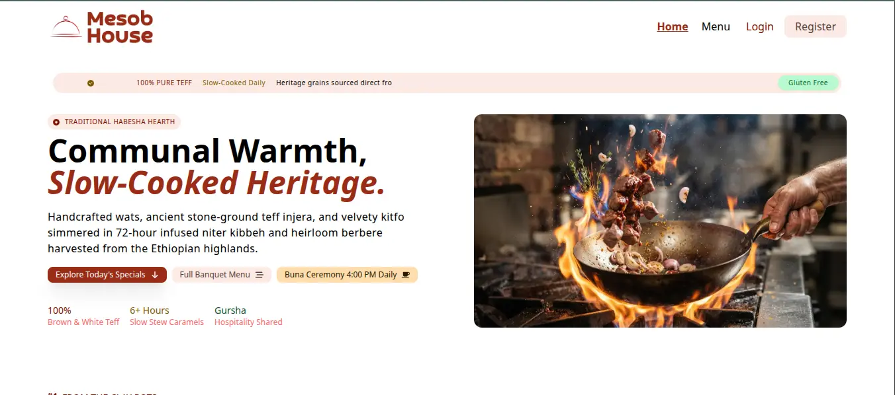
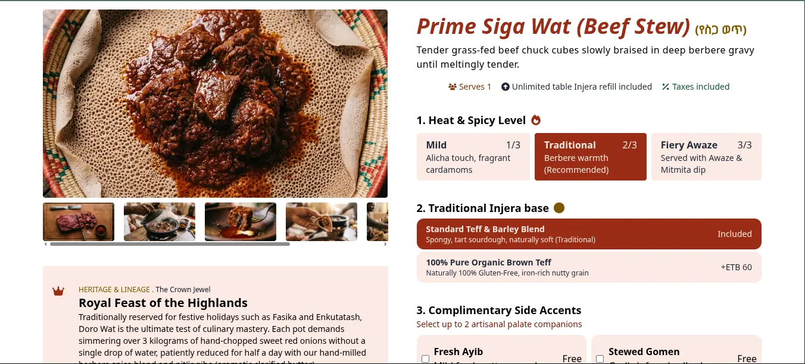
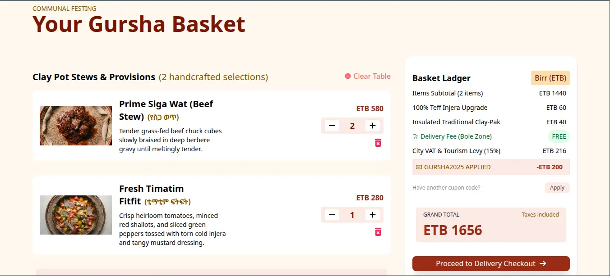
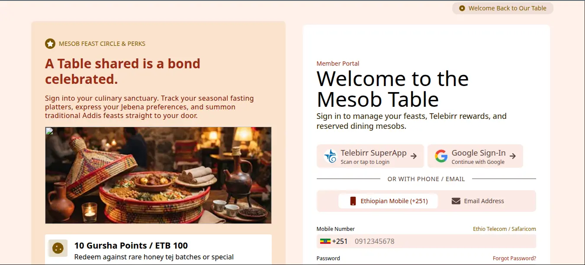

# Mesob House

A modern, full-featured web application for **Mesob House**, an Ethiopian restaurant. Customers can browse traditional dishes, manage a shopping cart, and place orders after authentication.


---

## Features

- **Authentication**
  - Register and login with **phone** or **email**
  - Protected routes (Cart & Checkout require login)
  - Persistent session via `localStorage`
  - Logout with loading feedback

- **Menu & Dishes**
  - Browse all dishes and special dishes
  - Dish detail pages with image gallery
  - Loading skeletons and error states
  - 404 handling for invalid dish slugs

- **Shopping Cart**
  - Add, remove, increment, and decrement items
  - Live subtotal, VAT (15%), and total calculation
  - Cart persistence with Zustand + `localStorage`
  - Cart indicator in the header

- **UI / UX**
  - Fully responsive (mobile-first)
  - Active navigation highlighting
  - Global popup notifications (success / error)
  - Scroll-to-top on route change
  - Error Boundary for unexpected crashes
  - Smooth loading states and spinners

- **Extra**
  - Hero image carousel
  - “Spirit of Gursha” cultural highlight section
  - Clean Ethiopian-inspired design system


---

## Screenshots

### Home Page


### Dish Detail


### Cart


### Login



---

## Tech Stack

| Category       | Technology                                |
|----------------|-------------------------------------------|
| Framework      | React (Vite)                              |
| Routing        | React Router DOM                          |
| State          | Zustand (Cart), Context API (Auth, Popup) |
| Forms          | React Hook Form + Zod                     |
| Styling        | Tailwind CSS                              |
| Icons          | React Icons                               |
| Deployment     | Vercel                                    |


---

## Project Structure

```
mesob-house/
├── public/                    # JSON files
├── screenshots/               # README screenshots
├── src/
│   ├── api/                   # API fetch
│   ├── assets/                # Images and static files
│   ├── auth/                  # Login, Register, AuthContext, and AuthProvider
│   ├── cart/                  # Cart, CartItem, useCartStore...
│   ├── checkout/              # Checkout, CheckoutForm, CheckoutMessage...
│   ├── checkout/              # HomeHero, SpecialDishes, Reflections...
│   ├── hooks/                 # useDebounce, useFetchDishes, and useFetchSpecials
│   ├── layout/                # RootLayout
│   ├── menu/                  # SearchBar, CategoryBar, DishDetail...
│   ├── sections/              # Header, Footer, HeaderCartInfo, UserProfile...
│   ├── ui/                    # Button, Spinner, Popup, Modal...
│   ├── App.jsx
│   ├── index.css
│   └── main.jsx
│   ├── NotFound.jsx
├── index.html
├── package.json
├── vercel.json
└── README.md
```

---

## Getting Started

### Prerequisites

- Node.js 18+
- npm or yarn

### Installation

```bash
# Clone the repository
git clone https://github.com/Amiir25/mesob-house.git

# Enter the project folder
cd mesob-house

# Install dependencies
npm install

# Start the development server
npm run dev
```